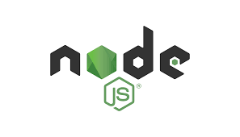
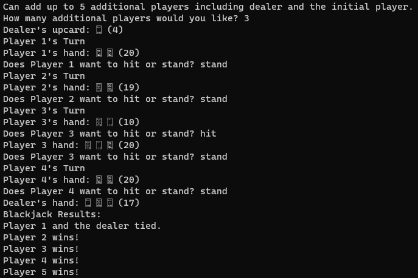

# Blackjack
## How to run the program

### 1) Install the Node.js. You will need Node.js to run the program from the terminal and because a module is used in the program.

### 2) Run the program with 'Node blackjack.js'

### 3) Play Blackjack!

### 4) Can now play Blackjack with multiple players!

